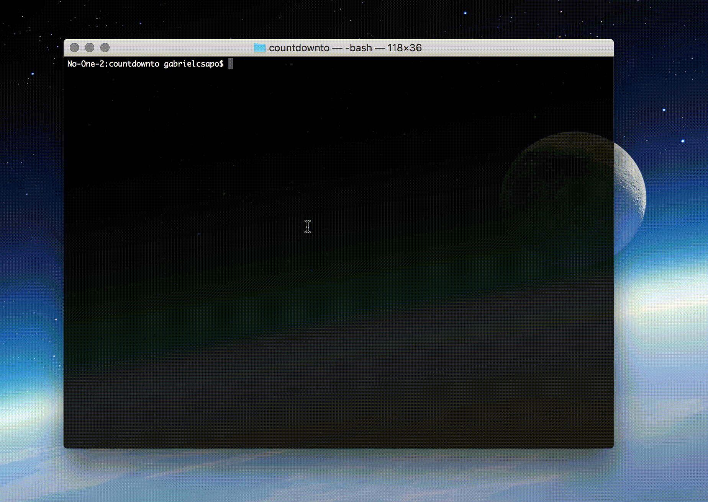

# countdownto

> ⏳ the countdown starts, when will it end?

[](https://www.npmjs.com/package/@gabrielcsapo/countdownto)
[](https://travis-ci.org/gabrielcsapo/countdownto)
[](https://lcov-server.gabrielcsapo.com/coverage/github%2Ecom/gabrielcsapo/countdownto)
[](https://starbuck.gabrielcsapo.com/github/gabrielcsapo/countdownto)
[](https://starbuck.gabrielcsapo.com/github/gabrielcsapo/countdownto#info=devDependencies)
[]()
[]()

<!-- TOC depthFrom:2 depthTo:6 withLinks:1 updateOnSave:1 orderedList:0 -->

- [Installation](#installation)
- [Usage](#usage)
	- [CLI](#cli)

<!-- /TOC -->

## Installation

```
npm install @gabrielcsapo/countdownto -g
```

## Usage

```js
const Countdownto = require('@gabrielcsapo/countdownto');

let countdown = new Countdownto(new Date('12/21/2020'));

console.log(countdown.diff());
```

To get a constantly updating diff use the tick function as such:

```js
const Countdownto = require('@gabrielcsapo/countdownto');

let countdown = new Countdownto(new Date('12/21/2020'));

countdown.tick((time) => {
	console.log(time.toString());
});
```

### CLI

```
Usage: countdownto [options]

Commands:
  -h, --help, help                Output usage information
  -v, --version, version          Output the version number

Options:
  -t, --to [date]                 The date that the countdown will aim for
  -f, --from [date]               The date that the countdown will start from, by default it is the time when the command was initiated at
  -c, --clock                     Will output an ascii clock that will update
```

Running the cli options like `countdownto --to 01/01/2017 --clock` will output:


